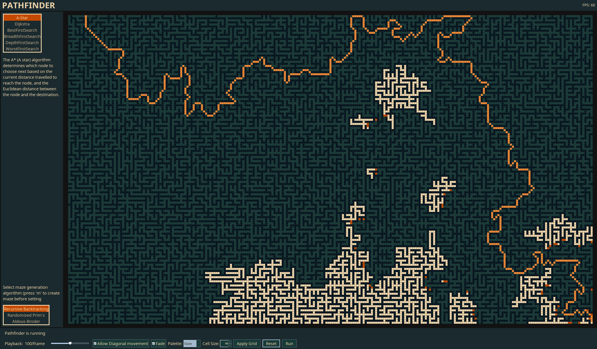
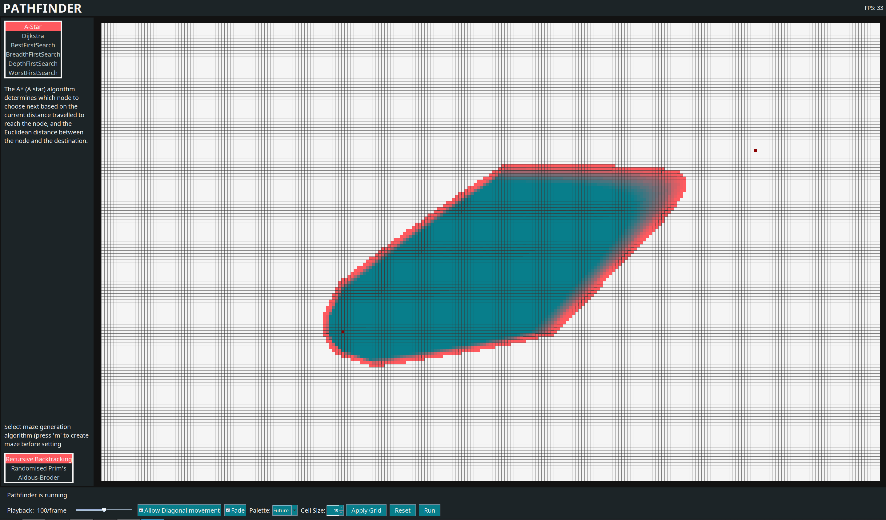
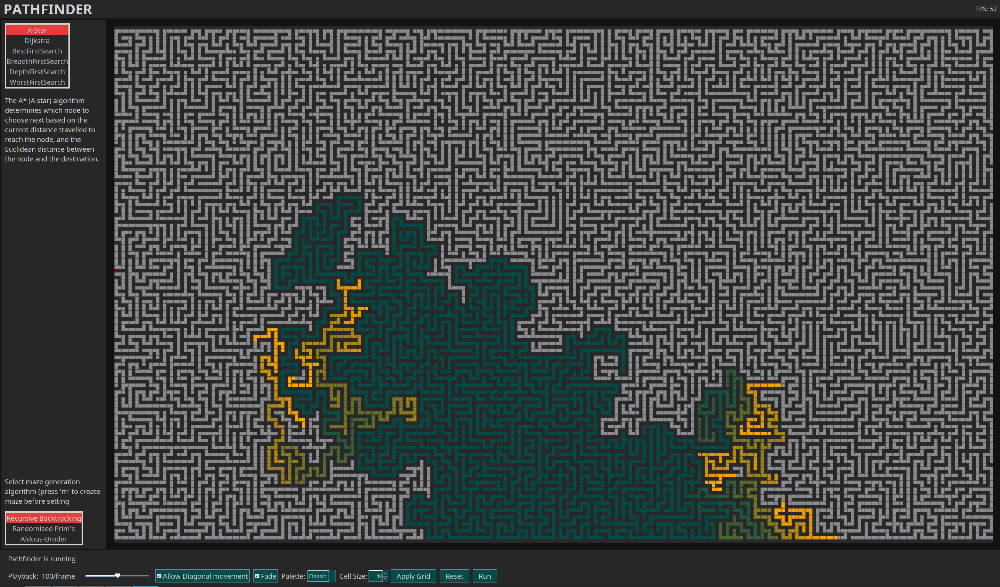

# Pathfinder

Pathfinder is a Java program for practicing algorithms through interactive pathfinding and maze visualization.



Download the latest Pathfinder.jar from the GitHub Releases page, then run it with:

```
java -jar Pathfinder.jar
```

## Features

- Visualize pathfinding algorithms on an interactive grid
- Set start and end points, then draw walls by clicking and dragging
- Generate mazes before running an algorithm
- Tune playback speed, cell size, diagonal movement, fade animation, and color palettes

### Pathfinding Algorithms

- A*
- Dijkstra
- Best First Search
- Breadth First Search
- Depth First Search
- Worst First Search 

### Maze Generators

- Recursive Backtracking
- Randomized Prim's
- Aldous-Broder

## Screenshots





## Development

Release instructions are in [docs/release.md](docs/release.md).
